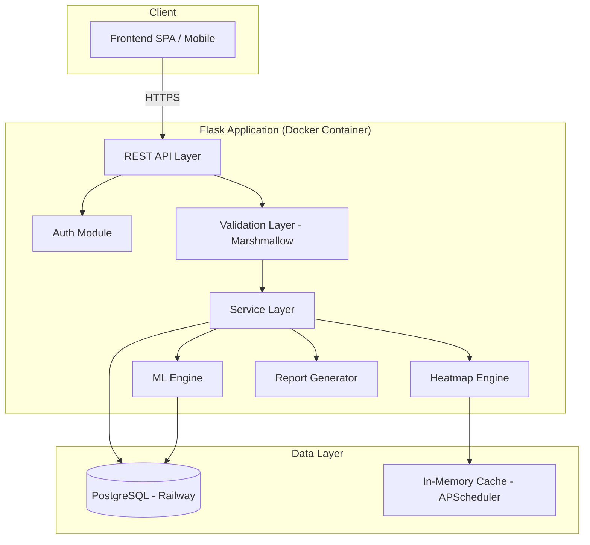
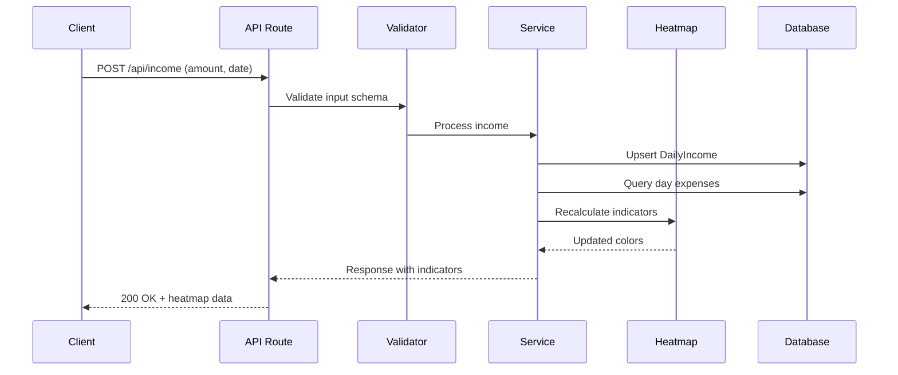
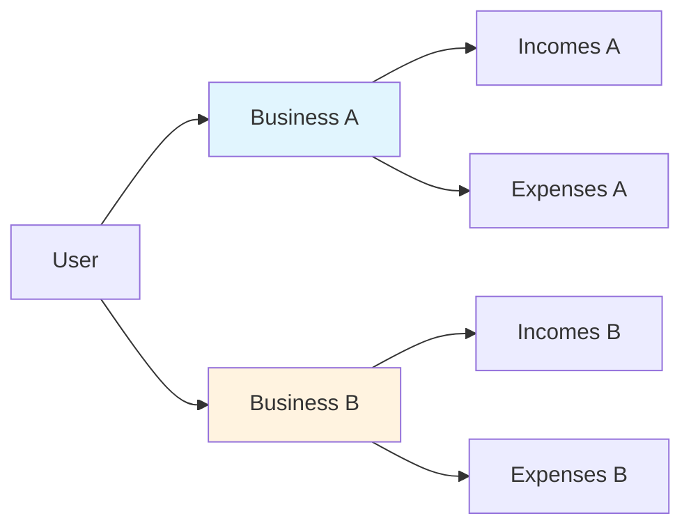
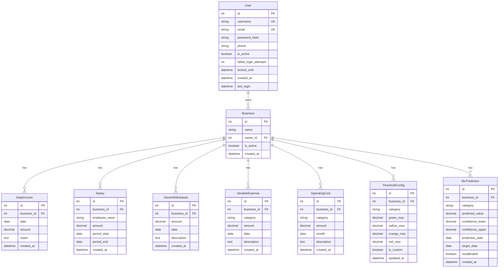

# Design: Gestión Financiera Comercial

## Overview

Sistema web de gestión financiera comercial que permite a comerciantes registrar ingresos brutos diarios, categorizar gastos, y visualizar la salud financiera mediante un sistema de semáforo (heatmap) de 5 niveles. Incluye un motor de Machine Learning para predicciones basadas en promedios móviles y un módulo de reportes temporales con comparativas.

### Decisiones de Diseño Clave

| Decisión | Elección | Justificación |
|----------|----------|---------------|
| Framework | Flask + SQLAlchemy | Ya establecido en el proyecto, maduro para APIs REST |
| Base de datos | PostgreSQL (Railway) | Soporte NUMERIC preciso para finanzas, JSONB para configuraciones |
| ML Library | scikit-learn + numpy | Ya en requirements.txt, suficiente para moving averages y regresión |
| Auth | Flask-Login + bcrypt | Sesiones server-side con hashing seguro |
| Serialization | Marshmallow | Ya incluido, schemas tipados para validación y respuesta |
| Deploy | Docker + Railway | CI/CD automático con Dockerfile existente |
| Multi-tenant | Row-level filtering por `business_id` | Simple, efectivo, sin overhead de schemas separados |

---

## Architecture

### High-Level System Architecture



### Request Flow



### Multi-Tenant Isolation



Toda consulta incluye `WHERE business_id = :current_business_id` para garantizar aislamiento. El `business_id` se obtiene de la sesión activa del usuario.

---

## Components and Interfaces

### 1. Auth Module (`app/routes/auth.py`)

```python
# API Endpoints
POST /api/auth/register   # Registro con validaciones
POST /api/auth/login      # Login con lockout
POST /api/auth/logout     # Cierre de sesión
GET  /api/auth/session    # Estado de sesión actual
```

**Responsabilidades:**
- Validación de username (min 8 chars, uppercase requerida)
- Validación RFC 5322 para email
- Validación de teléfono (7-15 dígitos)
- Hashing con bcrypt
- Lockout tras 5 intentos fallidos
- Expiración de sesión por inactividad (30 min)

### 2. Business Module (`app/routes/business.py`)

```python
POST   /api/businesses          # Crear negocio
GET    /api/businesses          # Listar negocios del usuario
PUT    /api/businesses/:id      # Actualizar negocio
DELETE /api/businesses/:id      # Desactivar negocio
POST   /api/businesses/:id/select  # Seleccionar negocio activo
```

### 3. Income Module (`app/routes/income.py`)

```python
POST /api/income              # Registrar ingreso bruto diario
GET  /api/income?date=YYYY-MM-DD  # Consultar ingreso por fecha
GET  /api/income?from=&to=    # Rango de fechas
PUT  /api/income/:id          # Actualizar (con confirmación overwrite)
```

### 4. Expenses Module (`app/routes/expenses.py`)

```python
# Salarios
POST /api/salaries            # Registrar salario
GET  /api/salaries?period=    # Consultar por período

# Retiros del dueño
POST /api/withdrawals         # Registrar retiro
GET  /api/withdrawals?period= # Consultar por período

# Gastos variables (8 categorías)
POST /api/variable-expenses          # Registrar gasto variable
GET  /api/variable-expenses?category=&date=  # Consultar

# Costos operativos
POST /api/operating-costs     # Registrar costo operativo
GET  /api/operating-costs?month=  # Consultar por mes
```

### 5. Heatmap Service (`app/services/heatmap.py`)

```python
GET /api/heatmap/daily?date=       # Heatmap de un día
GET /api/heatmap/summary?from=&to= # Resumen por período
```

**Interfaz interna:**

```python
def calculate_heatmap_color(percentage: float | None, thresholds: ThresholdConfig) -> str
def calculate_all_indicators(business_id: int, date: date) -> HeatmapResult
def get_net_profit_indicator(business_id: int, date: date) -> NetProfitResult
```

### 6. ML Engine (`app/services/ml_engine.py`)

```python
GET  /api/ml/prediction?category=   # Predicción para categoría
GET  /api/ml/trends                  # Tendencias generales
POST /api/ml/recalibrate            # Forzar recalibración
```

**Interfaz interna:**

```python
def calculate_moving_average(values: list[float], window: int = 90) -> list[float] | None
def needs_recalibration(current_value: float, predicted_value: float) -> bool
def predict_next_period(business_id: int, category: str) -> PredictionResult
```

### 7. Reports Module (`app/routes/reports.py`)

```python
GET  /api/reports?granularity=&from=&to=       # Generar reporte
GET  /api/reports/compare?period1=&period2=    # Comparativa
GET  /api/reports/export?format=pdf|csv        # Exportar
```

---

## Data Models

### Entity Relationship Diagram



### Threshold Configuration (Defaults)

| Categoría | 🟢 Green | 🟡 Yellow | 🟠 Orange | 🔴 Red | 🚨 Critical |
|-----------|----------|-----------|-----------|--------|-------------|
| Salarios empleados | <18% | 18-22% | 22-28% | 28-35% | >35% |
| Retiros dueño | <10% | 10-15% | 15-20% | 20-25% | >25% |
| Mercadería | <40% | 40-45% | 45-50% | 50-60% | >60% |
| Ganancia neta | ≥20% | 10-20% | 5-10% | <5% | N/A |

Las 8 categorías de gastos variables (comisiones, mermas, servicios, insumos, mantenimiento, impuestos municipales, seguros, logística) tendrán umbrales configurables por negocio almacenados en `ThresholdConfig`.

### New Model: OwnerWithdrawal

```python
class OwnerWithdrawal(db.Model):
    """Owner personal withdrawals - separate from employee salaries."""
    __tablename__ = 'owner_withdrawals'

    id = db.Column(db.Integer, primary_key=True)
    business_id = db.Column(db.Integer, db.ForeignKey('businesses.id'), nullable=False)
    amount = db.Column(db.Numeric(12, 2), nullable=False)
    date = db.Column(db.Date, nullable=False)
    description = db.Column(db.Text, nullable=True)
    created_at = db.Column(db.DateTime, default=lambda: datetime.now(timezone.utc))
```

### New Model: ThresholdConfig

```python
class ThresholdConfig(db.Model):
    """Configurable thresholds per category per business."""
    __tablename__ = 'threshold_configs'

    id = db.Column(db.Integer, primary_key=True)
    business_id = db.Column(db.Integer, db.ForeignKey('businesses.id'), nullable=False)
    category = db.Column(db.String(50), nullable=False)
    green_max = db.Column(db.Numeric(5, 2), nullable=False)
    yellow_max = db.Column(db.Numeric(5, 2), nullable=False)
    orange_max = db.Column(db.Numeric(5, 2), nullable=False)
    red_max = db.Column(db.Numeric(5, 2), nullable=False)
    is_custom = db.Column(db.Boolean, default=False)
    updated_at = db.Column(db.DateTime, default=lambda: datetime.now(timezone.utc))

    __table_args__ = (
        db.UniqueConstraint('business_id', 'category', name='uq_business_category_threshold'),
    )
```

---

## Low-Level Design: Algorithms

### Heatmap Calculation Algorithm

```python
def calculate_heatmap_color(percentage: float | None, thresholds: dict) -> str:
    """
    Determine heatmap color based on percentage and threshold configuration.
    
    Algorithm:
    1. If percentage is None -> 'neutral' (gray)
    2. Compare percentage against ordered thresholds
    3. Return first color where percentage <= threshold max
    4. If exceeds all thresholds -> 'critical'
    
    Time complexity: O(1) - fixed 4 comparisons
    """
    if percentage is None:
        return 'neutral'
    if percentage <= thresholds['green']:
        return 'green'
    elif percentage <= thresholds['yellow']:
        return 'yellow'
    elif percentage <= thresholds['orange']:
        return 'orange'
    elif percentage <= thresholds['red']:
        return 'red'
    else:
        return 'critical'
```

### Net Profit Calculation

```python
def calculate_net_profit(business_id: int, date_range: tuple[date, date]) -> NetProfitResult:
    """
    Formula: Ganancia Neta = Ingreso Bruto - Salarios - Retiros - Gastos Variables - Costos Operativos
    
    Algorithm:
    1. Sum all DailyIncome for the period
    2. Sum all Salary records overlapping the period
    3. Sum all OwnerWithdrawal records in the period
    4. Sum all VariableExpense records in the period
    5. Sum all OperatingCost records in the period
    6. net_profit = income - salaries - withdrawals - variable - operating
    7. net_percentage = (net_profit / income) * 100 if income > 0
    8. Apply threshold to get color
    
    Returns:
        NetProfitResult(amount, percentage, color)
    """
```

### ML Engine: Moving Average Implementation

```python
def calculate_moving_average(values: list[float], window: int = 90) -> list[float] | None:
    """
    Calculate simple moving average using convolution.
    
    Algorithm:
    1. Reject if len(values) < MIN_RECORDS (5)
    2. Adjust window = min(window, len(values))
    3. Create uniform weights: [1/window] * window
    4. Apply numpy convolution with mode='valid'
    5. Return list of averaged values
    
    Time complexity: O(n) where n = len(values)
    Space complexity: O(n)
    """
```

### ML Engine: Recalibration Decision

```python
def needs_recalibration(current_value: float, predicted_value: float) -> bool:
    """
    Determine if prediction model needs recalibration.
    
    Algorithm:
    1. If predicted_value == 0: return current_value != 0
    2. variation = |current - predicted| / |predicted|
    3. Return variation > 0.10 (10% threshold)
    
    Time complexity: O(1)
    """
```

### ML Engine: Prediction with Confidence Interval

```python
def predict_next_period(business_id: int, category: str) -> PredictionResult:
    """
    Generate prediction using moving average with confidence interval.
    
    Algorithm:
    1. Fetch last 90 days of data for category
    2. If records < 5: return InsufficientData
    3. Calculate moving average (MA)
    4. Calculate standard deviation of residuals
    5. predicted = last MA value
    6. confidence_interval = predicted +/- 1.96 * std (95% CI)
    7. trend = 'up' | 'down' | 'stable' based on MA slope
    8. Check if recalibration needed
    
    Returns:
        PredictionResult(predicted, confidence_lower, confidence_upper, trend, needs_recalibration)
    """
```

### Percentage Calculation (Base 100%)

```python
def calculate_percentage_of_income(expense_amount: Decimal, gross_income: Decimal) -> float | None:
    """
    All expenses expressed as percentage of gross income.
    
    Algorithm:
    1. If gross_income <= 0 or is None: return None (neutral)
    2. percentage = (expense_amount / gross_income) * 100
    3. Round to 2 decimal places
    
    Time complexity: O(1)
    """
```

### Report Comparison Algorithm

```python
def compare_periods(period1_data: PeriodSummary, period2_data: PeriodSummary) -> ComparisonResult:
    """
    Compare two periods showing absolute and percentage variation.
    
    Algorithm:
    1. For each metric (income, expenses by category, net profit):
       a. absolute_diff = period2.value - period1.value
       b. if period1.value != 0:
            percentage_diff = (absolute_diff / period1.value) * 100
          else:
            percentage_diff = None (cannot compare from zero base)
    2. Determine trend direction for each metric
    3. Return side-by-side comparison
    """
```

### Input Validation Algorithms

```python
def validate_username(username: str) -> tuple[bool, str | None]:
    """
    Rules:
    1. len(username) >= 8
    2. At least one uppercase letter (A-Z)
    
    Returns: (is_valid, error_message)
    """

def validate_email_rfc5322(email: str) -> bool:
    """
    Validate email against RFC 5322 pattern.
    Uses a comprehensive regex that covers:
    - Local part: alphanumeric, dots, special chars in quotes
    - @ separator
    - Domain part: valid hostname with TLD
    """

def validate_phone(phone: str) -> bool:
    """
    Validate phone number has 7-15 digits only.
    Strip non-digit characters, then check length.
    """
```

### Session Management Algorithm

```python
def check_session_validity(session) -> bool:
    """
    Algorithm:
    1. If session.last_activity is None: return False
    2. elapsed = now - session.last_activity
    3. If elapsed > 30 minutes: expire session, return False
    4. Else: update last_activity = now, return True
    """

def handle_failed_login(user) -> None:
    """
    Algorithm:
    1. Increment user.failed_login_attempts
    2. If failed_login_attempts >= 5:
       a. Set user.locked_until = now + lockout_duration
       b. Return "Account locked" error
    3. Else: return "Invalid credentials" error
    """
```

---

## Correctness Properties

*A property is a characteristic or behavior that should hold true across all valid executions of a system — essentially, a formal statement about what the system should do. Properties serve as the bridge between human-readable specifications and machine-verifiable correctness guarantees.*

### Property 1: Username validation rejects short or lowercase-only strings

*For any* string with fewer than 8 characters OR without at least one uppercase letter, the username validator SHALL reject it and return an appropriate error message.

**Validates: Requirements 1.1, 1.2**

### Property 2: Phone validation enforces digit length bounds

*For any* string, after extracting only digit characters, the phone validator SHALL accept it if and only if the digit count is between 7 and 15 inclusive.

**Validates: Requirements 1.4**

### Property 3: Account lockout activates at threshold

*For any* user with N consecutive failed login attempts where N >= 5, the system SHALL lock the account. For N < 5, the account SHALL remain unlocked.

**Validates: Requirements 2.2**

### Property 4: Session expiration by inactivity

*For any* session with a last_activity timestamp, the session SHALL be marked expired if and only if the elapsed time since last_activity exceeds 30 minutes.

**Validates: Requirements 2.3**

### Property 5: Multi-tenant data isolation

*For any* query scoped to a business_id B, the result set SHALL contain zero records belonging to any business_id != B.

**Validates: Requirements 2.5**

### Property 6: Income amount range enforcement

*For any* numeric value V submitted as daily income, the system SHALL accept it if and only if 0.01 <= V <= 999,999,999.99.

**Validates: Requirements 3.1**

### Property 7: Percentage calculation relative to gross income

*For any* expense amount E and gross income G where G > 0, the calculated percentage SHALL equal (E / G) * 100, and this value SHALL be used for all threshold evaluations.

**Validates: Requirements 3.2**

### Property 8: Heatmap color mapping is deterministic and exhaustive

*For any* percentage value P and valid threshold configuration T, the heatmap function SHALL return exactly one of the 6 possible states (green, yellow, orange, red, critical, neutral), and for P = None it SHALL always return neutral.

**Validates: Requirements 4.1, 4.2**

### Property 9: Salary threshold color mapping

*For any* percentage P representing total employee salaries relative to gross income, the system SHALL assign: green if P < 18, yellow if 18 <= P < 22, orange if 22 <= P < 28, red if 28 <= P < 35, critical if P >= 35.

**Validates: Requirements 5.1, 5.2, 5.3, 5.4, 5.5**

### Property 10: Owner withdrawal threshold color mapping

*For any* percentage P representing total owner withdrawals relative to gross income, the system SHALL assign: green if P < 10, yellow if 10 <= P < 15, orange if 15 <= P < 20, red if 20 <= P < 25, critical if P >= 25.

**Validates: Requirements 5.6, 5.7, 5.8, 5.9, 5.10**

### Property 11: Variable expense category exclusivity

*For any* variable expense record, it SHALL belong to exactly one of the 8 valid categories: comisiones, mermas, servicios, insumos, mantenimiento, impuestos municipales, seguros, logística.

**Validates: Requirements 6.1**

### Property 12: Category-specific threshold application

*For any* category C and percentage P, the heatmap color SHALL be determined by applying the threshold configuration specific to category C, not any other category's thresholds.

**Validates: Requirements 6.2, 6.3, 6.4, 6.5, 6.6, 6.7, 6.8, 6.9, 7.1, 7.2, 7.3, 7.4, 7.5, 7.6**

### Property 13: Net profit formula consistency

*For any* set of financial records for a business and period, the net profit SHALL equal: gross_income - total_salaries - total_withdrawals - total_variable_expenses - total_operating_costs. The sum of individual components SHALL equal the total deductions.

**Validates: Requirements 6.10, 7.7, 8.1**

### Property 14: Net profit threshold color mapping

*For any* net profit percentage P relative to gross income, the system SHALL assign: green if P >= 20, yellow if 10 <= P < 20, orange if 5 <= P < 10, red if P < 5.

**Validates: Requirements 8.2, 8.3, 8.4, 8.5**

### Property 15: Moving average requires minimum records

*For any* value series with fewer than 5 records, the moving average function SHALL return None (insufficient data). For series with 5 or more records, it SHALL return a valid result.

**Validates: Requirements 9.1, 9.3**

### Property 16: Recalibration triggers on variation exceeding 10%

*For any* pair (current_value, predicted_value) where predicted_value != 0, the system SHALL trigger recalibration if and only if |current - predicted| / |predicted| > 0.10.

**Validates: Requirements 9.2**

### Property 17: Period comparison calculation

*For any* two periods with financial data, the comparison SHALL report the absolute difference (period2 - period1) and the percentage variation ((period2 - period1) / period1 * 100) for each metric.

**Validates: Requirements 10.2**

### Property 18: Text filter correctness

*For any* text filter F and dataset D, all items in the filtered result SHALL contain F (case-insensitive) in their category or description fields. No item matching F SHALL be excluded from results.

**Validates: Requirements 10.3**

---

## Error Handling

### Validation Errors (400 Bad Request)

| Contexto | Error | Mensaje |
|----------|-------|---------|
| Username corto | `VALIDATION_USERNAME_LENGTH` | "Username debe tener mínimo 8 caracteres" |
| Username sin mayúscula | `VALIDATION_USERNAME_UPPERCASE` | "Username debe contener al menos una mayúscula" |
| Email inválido | `VALIDATION_EMAIL_FORMAT` | "Email inválido" |
| Teléfono inválido | `VALIDATION_PHONE_FORMAT` | "Número de celular debe tener entre 7 y 15 dígitos" |
| Monto fuera de rango | `VALIDATION_AMOUNT_RANGE` | "Monto debe estar entre 0.01 y 999,999,999.99" |
| Categoría inválida | `VALIDATION_INVALID_CATEGORY` | "Categoría no válida" |

### Authentication Errors (401/403)

| Contexto | Error | Mensaje |
|----------|-------|---------|
| Credenciales incorrectas | `AUTH_INVALID_CREDENTIALS` | "Credenciales inválidas" |
| Cuenta bloqueada | `AUTH_ACCOUNT_LOCKED` | "Cuenta bloqueada temporalmente" |
| Sesión expirada | `AUTH_SESSION_EXPIRED` | "Sesión expirada por inactividad" |
| Sin acceso al negocio | `AUTH_BUSINESS_FORBIDDEN` | "No tiene acceso a este negocio" |

### Business Logic Errors (409/422)

| Contexto | Error | Mensaje |
|----------|-------|---------|
| Ingreso duplicado | `INCOME_DUPLICATE_DATE` | "Ya existe un ingreso para esta fecha" |
| Datos insuficientes ML | `ML_INSUFFICIENT_DATA` | "Datos insuficientes, se requieren mínimo 5 registros" |
| Negocio no seleccionado | `BUSINESS_NOT_SELECTED` | "Debe seleccionar un negocio activo" |

### Error Response Format

```json
{
  "error": {
    "code": "VALIDATION_USERNAME_LENGTH",
    "message": "Username debe tener mínimo 8 caracteres",
    "field": "username"
  }
}
```

### Rate Limiting and Recovery

- Login: máximo 5 intentos por cuenta, lockout temporal (15 minutos)
- API general: 100 requests/minuto por usuario autenticado
- ML predictions: 10 requests/minuto (computacionalmente costoso)

---

## Testing Strategy

### Unit Tests (pytest)

- **Validadores**: Test con ejemplos específicos para cada regla de validación
- **Edge cases**: Valores límite (0.01, 999999999.99, exactamente 8 chars, etc.)
- **Error conditions**: Inputs inválidos, None values, tipos incorrectos
- **Format**: Verificar que respuestas incluyen campos requeridos

### Property-Based Tests (Hypothesis)

Library: **[Hypothesis](https://hypothesis.readthedocs.io/)** - el estándar PBT para Python.

**Configuración:**
- Mínimo 100 iteraciones por property test
- Cada test referencia su propiedad del documento de diseño
- Tag format: `Feature: commercial-financial-management, Property {N}: {description}`

**Properties a implementar:**
1. Validación de username (Properties 1)
2. Validación de teléfono (Property 2)
3. Lockout threshold (Property 3)
4. Session expiration (Property 4)
5. Income range enforcement (Property 6)
6. Percentage calculation (Property 7)
7. Heatmap color determinism (Property 8)
8. Salary thresholds (Property 9)
9. Withdrawal thresholds (Property 10)
10. Category exclusivity (Property 11)
11. Category-specific thresholds (Property 12)
12. Net profit formula (Property 13)
13. Net profit thresholds (Property 14)
14. Moving average minimum records (Property 15)
15. Recalibration trigger (Property 16)
16. Period comparison (Property 17)
17. Text filter (Property 18)

### Integration Tests

- **Multi-tenant isolation** (Property 5): Test con múltiples negocios en DB real
- **Registration flow**: End-to-end con base de datos
- **Income recalculation cascade**: Guardar ingreso y verificar actualización de indicadores
- **ML recalibration**: Trigger y verificar actualización de umbrales
- **Report export**: Generación PDF/CSV válida

### Performance Tests

- Heatmap recalculation < 2 segundos con dataset realista
- ML prediction response time con 90+ records

### CI Pipeline Tests

```yaml
# .github/workflows/test.yml
- pytest --cov=app tests/
- pytest tests/property/ -x --hypothesis-seed=random
```
